<div align="center">
  
</div>

<div align="center">
  
</div>

<br/>

### `$ pacman -Qi oshico`

```text
Name            : oshico
Version         : 22.0.0-1
Description     : Informatics Engineering graduate,
                  MSc in progress (Portugal)
Architecture    : x86_64
URL             : https://github.com/oshico
Licenses        : open-source at heart
Depends On      : linux  git  coffee
Optional Deps   : clean-code       [installed]
                  documentation    [installed]
                  system-design    [installing...]
Install Reason  : Explicitly installed
```

### `$ pacman -Q | column -t`

```text
languages/   c  c++  rust  go  zig  java  kotlin  python  php  typescript  javascript
frontend/    react  vite  tailwindcss  bootstrap  html  css
backend/     spring-boot  laravel  hibernate  rabbitmq  junit  jwt
databases/   postgresql  mongodb  sql-server
devops/      docker  git  github-actions  gitlab  gitea  forgejo  cmake
tooling/     bash  postman  swagger  jira  npm  bun  yarn
hardware/    arduino  raspberry-pi
```

### `$ journalctl --user -u oshico --since today`

```text
[ OK ] Started daily-driver.target (Linux)
[ OK ] Reached target Master's Degree — Informatics Engineering
[INFO] Building software that is clean, practical and reliable
[INFO] Advocating for maintainable, well-documented code
[ .. ] Learning: always
```

### `$ cat ~/.config/contact.conf`

```text
[discord]
user = oshico

[linkedin]
url = linkedin.com/in/francisco-miguel-gomes-oliveira
```

<div align="center">

[`❯ connect --linkedin`](https://linkedin.com/in/francisco-miguel-gomes-oliveira) &nbsp;·&nbsp; [`❯ connect --discord`](https://discord.com/users/oshico)

<br/>

```text
❯ exit
[Process completed — thanks for stopping by]
```

</div>
